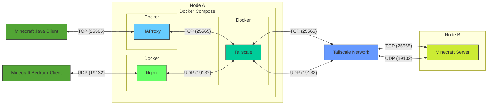

# mc-tailscale-proxy

```mermaid
graph LR
    %% Nodes
    A1[Minecraft Java Client]
    A2[Minecraft Bedrock Client]
    D[Tailscale Network]
    E[Minecraft Server]

    %% Node A と Docker Compose
    subgraph Node A [Node A]
        subgraph Docker_Compose [Docker Compose]
            subgraph TCP_Route [Docker]
                B[HAProxy]
            end

            subgraph UDP_Route [Docker]
                C[Nginx]
            end

            subgraph Tailscale [Docker]
                F[Tailscale]
            end
        end
    end

    %% Node B (Minecraft Server)
    subgraph Node B [Node B]
        E[Minecraft Server]
    end

    %% Java Client (TCP Route)
    A1 --TCP (25565)<--> B
    B --TCP (25565)<--> F
    F --TCP (25565)<--> D
    D --TCP (25565)<--> E

    %% Bedrock Client (UDP Route)
    A2 --UDP (19132)<--> C
    C --UDP (19132)<--> F
    F --UDP (19132)<--> D
    D --UDP (19132)<--> E

%% Styling
    style A1 fill:#52A535,stroke:#333,stroke-width:4px   %% Minecraft Java Client
    style A2 fill:#52A535,stroke:#333,stroke-width:4px   %% Minecraft Bedrock Client
    style B fill:#66ccff,stroke:#333,stroke-width:2px    %% HAProxy
    style C fill:#66ff66,stroke:#333,stroke-width:2px    %% Nginx
    style F fill:#00cc99,stroke:#333,stroke-width:2px    %% Tailscale
    style E fill:#cceb34,stroke:#333,stroke-width:2px    %% Minecraft Server
    style D fill:#6699ff,stroke:#333,stroke-width:2px    %% Tailscale Network
```

## Usage

- `tcp/haproxy.cfg` `udp/nginx.conf`
  - `tailscale_ip` 対象サーバーの Tailscale IPv4 アドレスを入力
  - 任意のポートを入力
